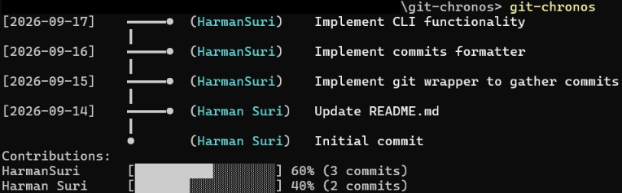

# git-chronos
> **A lightweight CLI to visualize messy git logs as easy-to-read timelines in your terminal**

---

## 🧐 The Problem

Many developers love how easy and quick the git CLI is for managing commits, but as projects grow, it can be hard to visualize commit trees and see who's done what. git-chronos is a simple wrapper for git which displays git log's output in an easy-to-read timeline, rather than large blocks of text.

---

## ⚡ Quick Start
Clone this repository:
```sh
git clone [https://github.com/your-username/git-visual-diff.git](https://github.com/your-username/git-visual-diff.git)
```
Navigate to the repository:
```sh
cd git-visual-diff
```

Install globally in editable mode:
```sh
uv tool install --editable . --force
```
Ensure your `uv` tool path is sourced:
```sh
uv tool update-shell
```

---

## 💻 Usage
Basic usage (renders default timeline)
```sh
git-visual-diff
```
Limit output to a certain number of commits (default 10)
```sh
git-visual-diff -n 5
```
Filter commits by author
```sh
git-visual-diff --author "Jane Doe"
```
Strip colour codes (for CI/CD logs or file piping)
```sh
git-visual-diff --no-color
```

---

## ✨ Key Features

- **Visual Commit Timeline:** Renders Git history as a clean, colour-coded ASCII timeline.
- **Contributor Stats:** Displays author contribution ratios with visual progress bars.
- **Filtering Options:** Filter output by author (`--author`) or total commit count (`-n`).
- **Terminal-Friendly:** Automatic colour support with fallback for CI/CD environments (`-- no-colour`).
- **Smart Error Guard:** Gracefully handles non-Git directories and empty repository states.

---

## 🛠️ Tech Stack & Disciplines

* **Language:** Python (3.9+)
* **Package & Project Management:** `uv` by Astral (using `pyproject.toml` standards)
* **Architecture:** `src/` layout with strict operational separation
* **Disciplines:**
  * **System Subprocessing:** Non-blocking, stream-captured `git log` execution via `subprocess`.
  * **Terminal UX & ANSI Formatting:** Native terminal colorization without heavy third-party UI dependencies.
  * **Data Structuring:** Dataclasses and dynamic attribute lookup for decoupled visualization.

---

## 🏗️ Architecture & How It Works

The tool follows a clean **Data Engine → Visual Engine → Orchestrator** pipeline:

```text
       ┌───────────┐
       │   CLI     │  1. Parses arguments (--limit, --no-color, etc.)
       └─────┬─────┘
             │
             ▼
       ┌───────────┐
       │  git.py   │  2. Executes `git log`, captures stdout,
       └─────┬─────┘     and parses lines into Commit objects.
             │
             ▼
  ┌──────────┴──────────┐
  │   formatter.py      │  3. Converts raw Commit objects into ANSI-colored
  └──────────┬──────────┘     ASCII timelines and progress bars.
             │
             ▼
       ┌───────────┐
       │  Terminal │  4. Streams final formatted visual directly to stdout.
       └───────────┘
```
